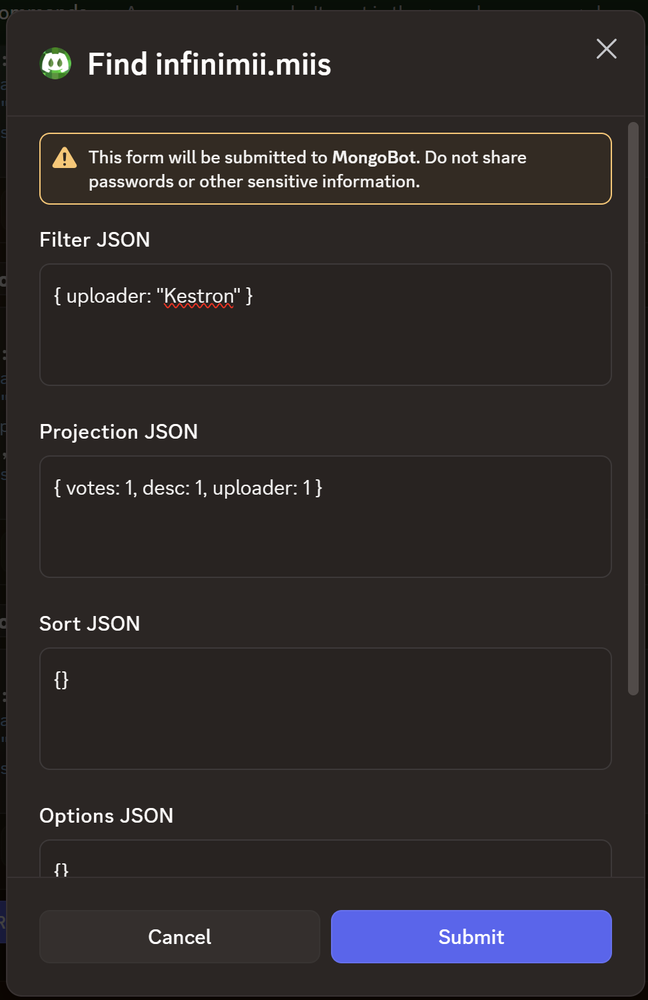
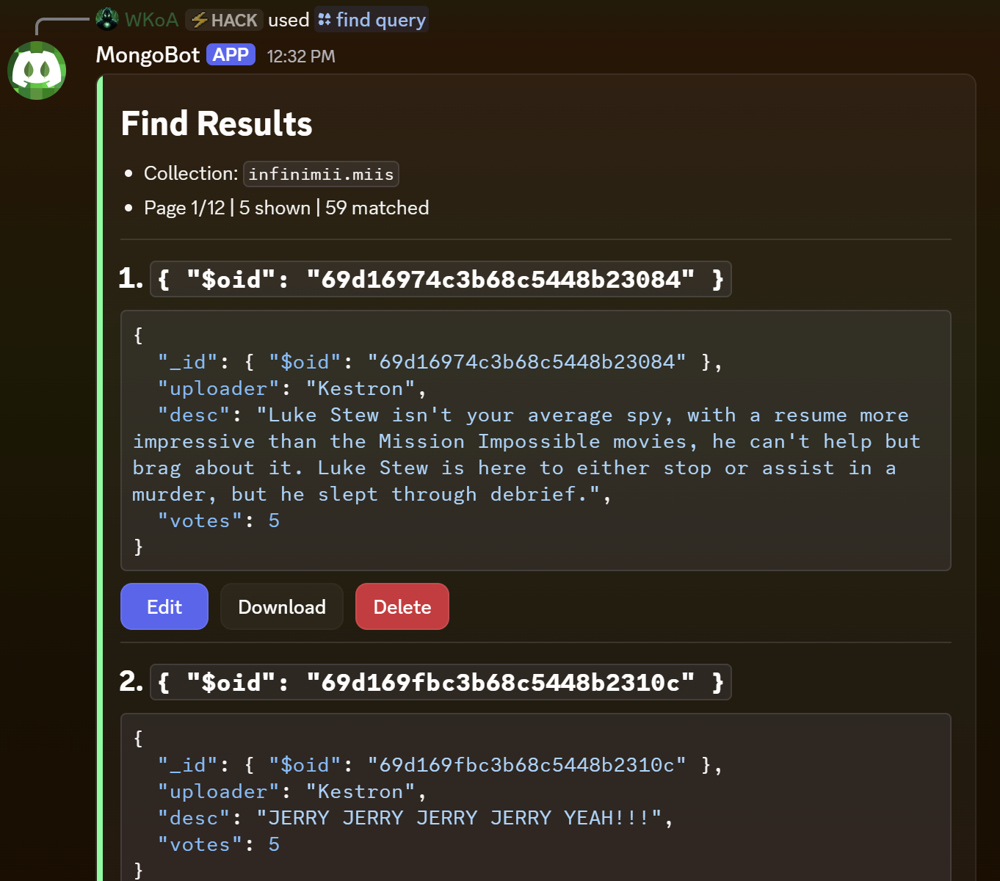
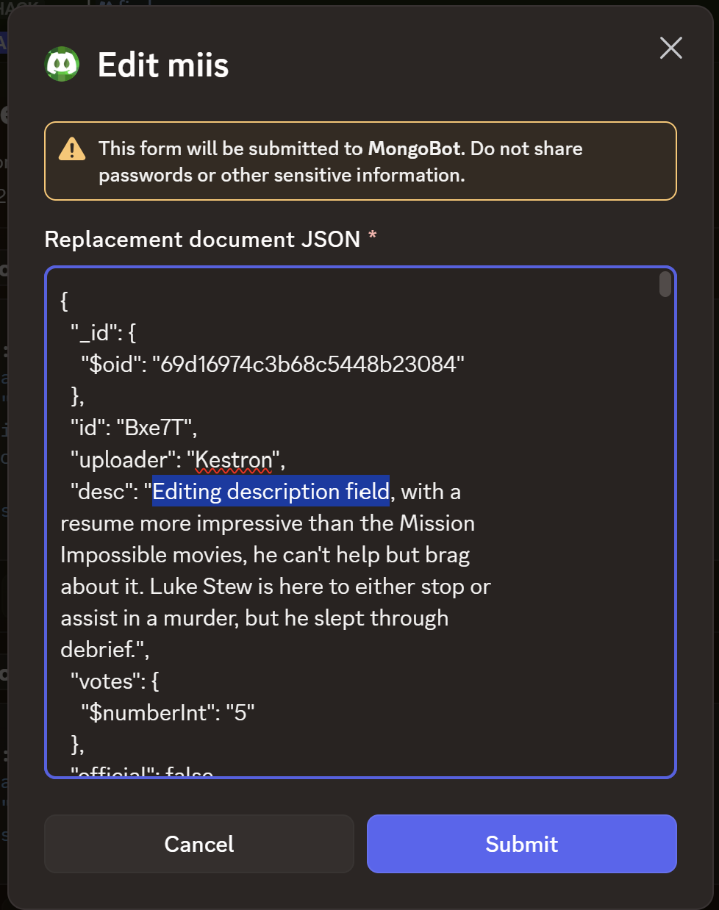
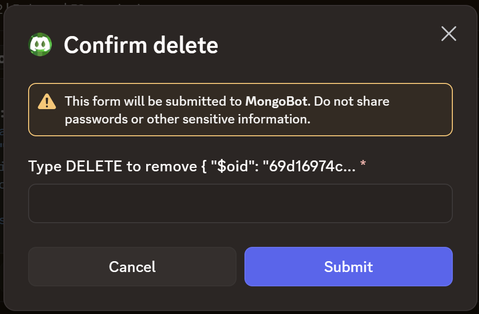
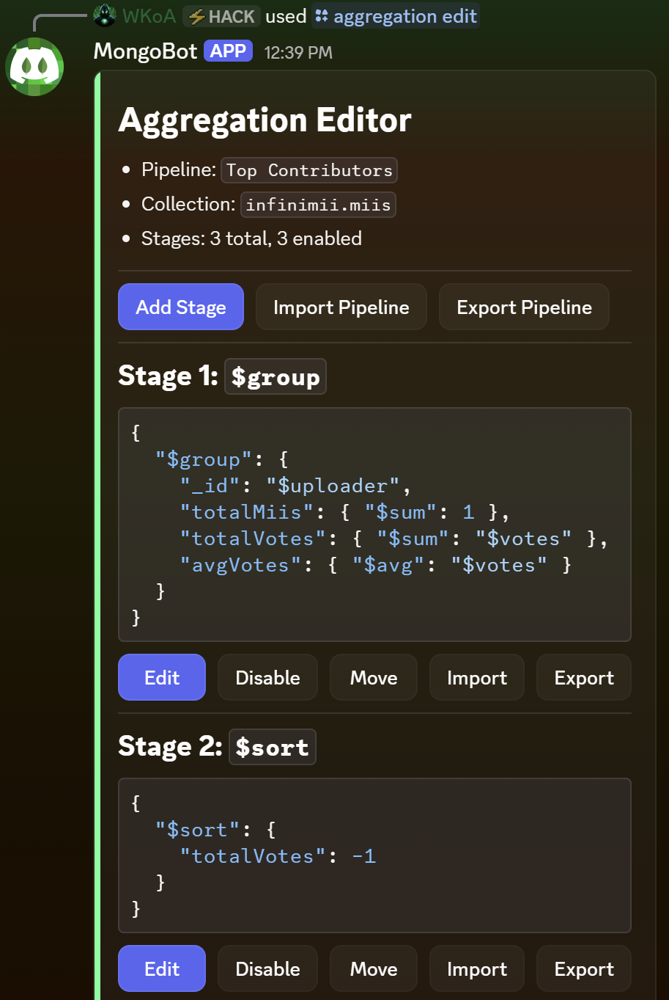
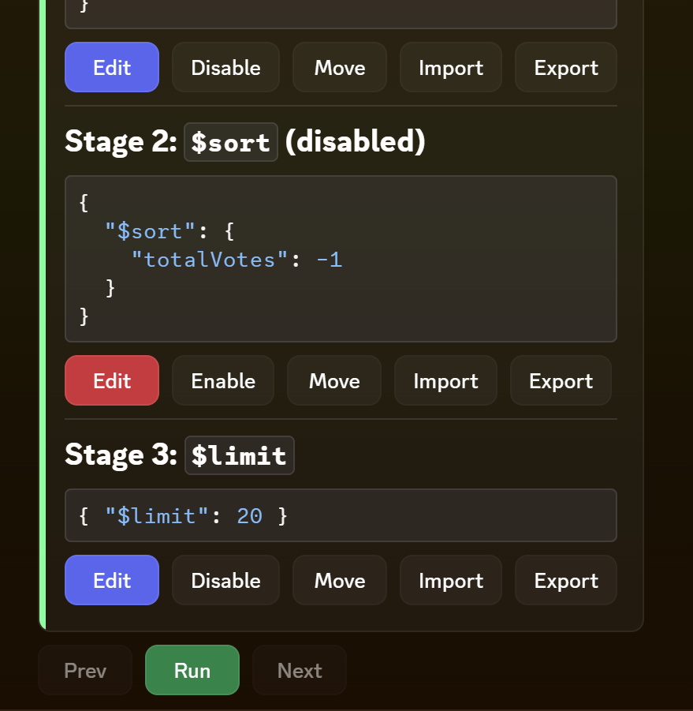
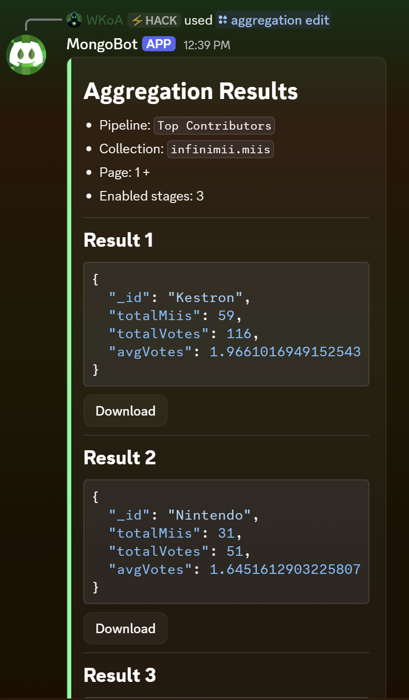
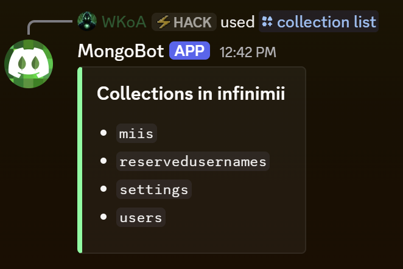
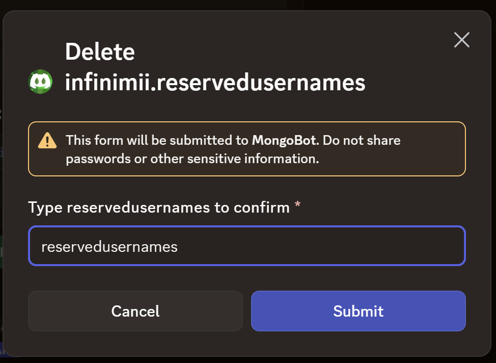

<br>
<p align="center">
  
</p>

# Mongocord - A Discord MongoDB Client

A Discord Bot MongoDB client. Designed to function similarly to MongoDB Compass, Mongocord supports managing your local or remote Atlas databases cross-platform entirely from Discord.

[](https://discord.gg/k3yVkrrvez)
&nbsp;
[](https://www.paypal.com/donate?business=kestron@kestron.software&no_recurring=0&item_name=KestronProgramming&item_number=Stewbot)


## Features

- `/find`
  - Opens the standard modal with projection, filter, and sort abilities.
  - Results are displayed like MongoDB and can be easily edited.

- `/aggregation create|edit|run|delete|import`
  - Saves pipelines globally for all users.
  - Shows a paginated stage editor with edit, enable/disable, move, import, and export controls.
  - Runs the pipeline inside Discord and shows a paginated read-only result view with downloads.

- `/import`
  - Import documents in JSON format into Mongo, just like Compass.

- `/database create|rename|delete|list`
  - Manage databases

- `/collection create|rename|delete|list`
  - Manage collections

- `/config`
  - `confirmations` by default, Mongocord will confirm before editing or deleting.
  - `admin_add`, `admin_remove`, and `admin_list` manage who can use Mongocord.

  


## Demo:

|  |  |  |
|--|--|--|
| <div align="center">Standard queries</div>  | <div align="center">Query results</div>  | <div align="center">Editing item</div>  |
| <div align="center">Deleting item</div>  | <div align="center">Aggrigation query editor</div>  | <div align="center">Aggregation feild editor</div>  |
| <div align="center">Aggregation results</div>  | <div align="center">Collection listing</div>  | <div align="center">Collection deletion</div>  |

<sup>Examples data shown taken from [InfiniMii](https://github.com/Stewared/InfiniMii) development database.</sup>


## Installation & Setup

1. Create a discord bot account at https://discord.com/developers/applications. Search for tutorials online for this step if needed.

1. Install dependencies:

```bash
npm install
```

2. Run the interactive setup:

```bash
npm run setup
```
This walks you through creating `env.json` and configuring PM2 to start Mongocord to run at boot.

3. The bot is setup. See this reference list for pm2 commands:
- Start/restart: `npm run pm2:start`
- Stop: `npm run pm2:stop`
- Status: `npm run pm2:status`
- Logs: `pm2 logs mongocord`

If you change PM2 process configuration and want it persisted across reboots, run:

```bash
pm2 save
```


